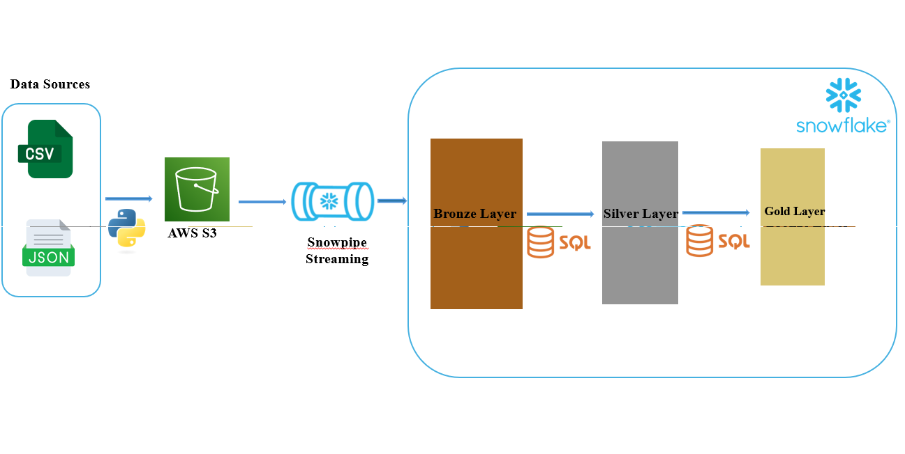

# 🛒 Ecommerce Data Pipeline

> End-to-end data pipeline orchestrated with **Apache Airflow**, ingesting synthetic ecommerce data through **AWS S3 + Snowpipe** into a **Snowflake** medallion architecture (Bronze → Silver → Gold), with automated data quality checks via **Great Expectations**.



---

## 📑 Table of Contents

- [Overview](#overview)
- [Architecture](#architecture)
- [Project Structure](#project-structure)
- [Prerequisites](#prerequisites)
- [Setup](#setup)
- [Running the Pipeline](#running-the-pipeline)
- [Data Layers](#data-layers)
- [Data Quality](#data-quality)
- [Environment Variables](#environment-variables)
- [Author](#author)

---

## Overview

This project simulates a production-grade ecommerce data pipeline:

1. **Synthetic data** (customers, products, sales) is generated daily by an Airflow DAG using `Faker`.
2. Files are uploaded to **AWS S3** into dedicated prefixes (`raw/customers/`, `raw/products/`, `raw/sales/`).
3. **Snowpipe** listens to S3 event notifications and automatically ingests new files into the Snowflake **Bronze** (raw) layer.
4. Airflow then triggers **SQL transformations** to build the **Silver** (cleaned) and **Gold** (aggregated analytics) layers.
5. **Great Expectations** validates data quality at each layer before proceeding.

---

## Architecture

```
┌─────────────────────┐
│  Airflow DAG        │  (daily schedule)
│  generate_fake_data │
└────────┬────────────┘
         │ CSV / JSON
         ▼
┌─────────────────────┐      S3 Event       ┌──────────────────────┐
│     AWS S3          │ ──────────────────► │  Snowpipe (auto)     │
│  raw/customers/     │                     │  loads → Bronze      │
│  raw/products/      │                     └──────────┬───────────┘
│  raw/sales/         │                                │
└─────────────────────┘                                ▼
                                            ┌──────────────────────┐
                                            │  Snowflake           │
                                            │  ┌────────────────┐  │
                                            │  │  Bronze (raw)  │  │
                                            │  └───────┬────────┘  │
                                            │          │ SQL       │
                                            │  ┌───────▼────────┐  │
                                            │  │ Silver (clean) │  │
                                            │  └───────┬────────┘  │
                                            │          │ SQL       │
                                            │  ┌───────▼────────┐  │
                                            │  │  Gold (aggreg) │  │
                                            │  └────────────────┘  │
                                            └──────────────────────┘
```

---

## Project Structure

```
Snowflake_Airflow_Pipeline/
│
├── dags/
│   ├── .airflowignore                  # Tells Airflow which files to ignore
│   └── eccomerce_pipeline_dag.py       # Main Airflow DAG (full pipeline)
│
├── scripts/
│   ├── generate_fake_data.py           # Generates synthetic CSV/JSON data
│   ├── from_local_to_s3.py             # Uploads local files to AWS S3
│   ├── data_validation.py              # Great Expectations validation suites
│   └── commands.sh                     # Project setup shell script
│
├── sql_code/
│   ├── bronze.sql                      # Warehouse, DB, schema & raw tables DDL
│   ├── snowpipe.sql                    # S3 stage + Snowpipe definitions
│   ├── silver.sql                      # Silver layer transformations
│   └── gold.sql                        # Gold layer aggregations
│
├── data/                               # Local data output directory (git-ignored)
├── log/                                # Pipeline logs
│
├── Architecture_image.png              # Architecture diagram
├── Dockerfile                          # Astro Runtime base image
├── airflow_settings.yaml               # Local Airflow connections / variables
├── requirements.txt                    # Python dependencies
└── README.md                           # This file
```

---

## Prerequisites

| Tool | Version |
|------|---------|
| Python | 3.11+ |
| Astro CLI | latest |
| Docker Desktop | 4.x+ |
| AWS Account | S3 + IAM |
| Snowflake Account | any edition |

---

## Setup

### 1. Clone the repository

```bash
git clone https://github.com/MohamedSAIFI0/Snowflake_Airflow_Pipeline.git
cd Snowflake_Airflow_Pipeline
```

### 2. Create and activate a virtual environment (for local scripts)

```bash
python3 -m venv venv
source venv/bin/activate        # Windows: venv\Scripts\activate
pip install -r requirements.txt
```

### 3. Configure environment variables

Create a `.env` file at the project root (never commit this file):

```env
# AWS
AWS_ACCESS_KEY_ID=your_access_key
AWS_SECRET_ACCESS_KEY=your_secret_key
AWS_REGION=us-east-1
S3_BUCKET_NAME=your-ecommerce-bucket

# Snowflake
SNOWFLAKE_USER=your_user
SNOWFLAKE_PASSWORD=your_password
SNOWFLAKE_ACCOUNT=your_account.region.cloud   # e.g. abc123.eu-west-1.aws
```

### 4. Set up Snowflake (run SQL scripts in order)

```sql
-- In Snowflake worksheet, run in this exact order:
1. sql_code/bronze.sql      -- Creates warehouse, database, schema, raw tables
2. sql_code/snowpipe.sql    -- Creates S3 stage and Snowpipe for each table
3. sql_code/silver.sql      -- Creates cleaned Silver tables
4. sql_code/gold.sql        -- Creates Gold analytics tables
```

### 5. Set up S3 Event Notifications for Snowpipe

In your S3 bucket → **Properties → Event Notifications**, create one notification per prefix:

| Prefix | Event type | Destination |
|--------|-----------|-------------|
| `raw/customers/` | All object create events | Snowflake SNS ARN |
| `raw/products/` | All object create events | Snowflake SNS ARN |
| `raw/sales/` | All object create events | Snowflake SNS ARN |

> The Snowflake SNS ARN is found in your storage integration details: `DESC INTEGRATION my_integration;`

### 6. Configure the Airflow Snowflake connection

Edit `airflow_settings.yaml` for local development:

```yaml
airflow:
  connections:
    - conn_id: snowflake_default
      conn_type: snowflake
      conn_login: your_user
      conn_password: your_password
      conn_extra:
        account: your_account.region.cloud
        warehouse: eccomerce_wh
        database: ecommerce_db
        schema: raw
```

Or via the Airflow UI: **Admin → Connections → Add → Snowflake**.

### 7. Start Airflow with Astro CLI

```bash
astro dev start
```

Access the Airflow UI at `http://localhost:8080` (default credentials: `admin` / `admin`).

---

## Running the Pipeline

### Automatic (Airflow)

The DAG `ecommerce_data_pipeline` runs **daily**. To trigger it manually:

```bash
astro dev run dags trigger ecommerce_data_pipeline
```

Or click **Trigger DAG** in the Airflow UI.

### Manual (standalone scripts)

```bash
# 1. Generate fake data locally
python scripts/generate_fake_data.py

# 2. Upload to S3
python scripts/from_local_to_s3.py

# 3. Run data validation
python scripts/data_validation.py
```

---

## Data Layers

### 🥉 Bronze — Raw Ingestion (`ecommerce_db.raw`)

| Table | Description |
|-------|-------------|
| `customers` | Raw customer records from CSV |
| `products` | Raw product catalogue from CSV |
| `sales` | Raw sales transactions from JSON |

Data lands here exactly as generated, via Snowpipe from S3.

### 🥈 Silver — Cleaned Data (`ecommerce_db.silver`)

| Table | Description |
|-------|-------------|
| `customers_clean` | Deduplicated, trimmed, normalised customers |
| `products_clean` | Deduplicated, positive-price-filtered products |
| `sales_enriched` | Sales joined with clean customers & products, with `total_amount` computed |

### 🥇 Gold — Analytics (`ecommerce_db.gold`)

| Table | Description |
|-------|-------------|
| `sales_by_country` | Total revenue, sales count and customer count per country |
| `top_products` | Products ranked by total revenue |
| `client_activity` | Per-customer purchase count, total spend and last purchase date |

---

## Data Quality

Validation is handled by **Great Expectations** (v1 Fluent API) in `scripts/data_validation.py` and natively inside the DAG's `data_quality_checks` task.

### Checks performed

| Layer | Check |
|-------|-------|
| Bronze | `customer_id` unique and not null |
| Bronze | `email` matches valid regex |
| Bronze | `price` between 0 and 10 000 |
| Bronze | `category` in allowed set |
| Silver | `sale_id`, `customer_id`, `product_id`, `total_amount` not null |
| Silver | `quantity` between 1 and 100 |
| Silver | `total_amount` ≥ 0 |
| Gold | `total_sales` ≥ 0 |
| Gold | `number_of_customers` ≥ 1 |

The DAG raises a `ValueError` and stops execution if any check fails, preventing bad data from reaching the Gold layer.

---

## Environment Variables

| Variable | Description | Required |
|----------|-------------|----------|
| `AWS_ACCESS_KEY_ID` | AWS IAM access key | ✅ |
| `AWS_SECRET_ACCESS_KEY` | AWS IAM secret key | ✅ |
| `AWS_REGION` | AWS region (e.g. `us-east-1`) | ✅ |
| `S3_BUCKET_NAME` | Target S3 bucket name | ✅ |
| `SNOWFLAKE_USER` | Snowflake username | ✅ |
| `SNOWFLAKE_PASSWORD` | Snowflake password | ✅ |
| `SNOWFLAKE_ACCOUNT` | Snowflake account identifier | ✅ |

---

## Author

**Mohamed SAIFI** — [saifimsc@gmail.com](mailto:saifimsc@gmail.com)

---

## References

- [Snowflake Documentation](https://docs.snowflake.com/)
- [AWS S3 Documentation](https://docs.aws.amazon.com/s3/)
- [Apache Airflow Documentation](https://airflow.apache.org/docs/)
- [Astronomer Astro CLI](https://www.astronomer.io/docs/astro/cli/overview)
- [Great Expectations Documentation](https://docs.greatexpectations.io/)